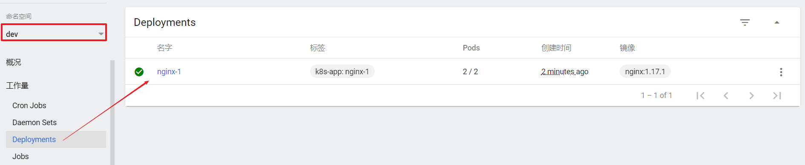

## 10.2 使用DashBoard

本章节以Deployment为例演示DashBoard的使用

**查看**

选择指定的命名空间`dev`，然后点击`Deployments`，查看dev空间下的所有deployment

**扩缩容**

在`Deployment`上点击`规模`，然后指定`目标副本数量`，点击确定

**编辑**

在`Deployment`上点击`编辑`，然后修改`yaml文件`，点击确定

**查看Pod**

点击`Pods`, 查看pods列表

**操作Pod**

选中某个Pod，可以对其执行日志（logs）、进入执行（exec）、编辑、删除操作

> Dashboard提供了kubectl的绝大部分功能，这里不再一一演示

