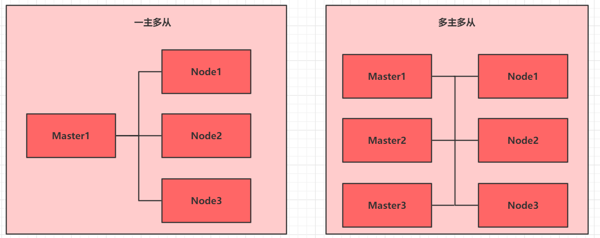

## 2.1 前置知识点

目前生产部署Kubernetes 集群主要有两种方式：

**kubeadm**

Kubeadm 是一个K8s 部署工具，提供kubeadm init 和kubeadm join，用于快速部署Kubernetes 集群。

官方地址：https://kubernetes.io/docs/reference/setup-tools/kubeadm/kubeadm/

**二进制包**

从github 下载发行版的二进制包，手动部署每个组件，组成Kubernetes 集群。

Kubeadm 降低部署门槛，但屏蔽了很多细节，遇到问题很难排查。如果想更容易可控，推荐使用二进制包部署Kubernetes 集群，虽然手动部署麻烦点，期间可以学习很多工作原理，也利于后期维护。

