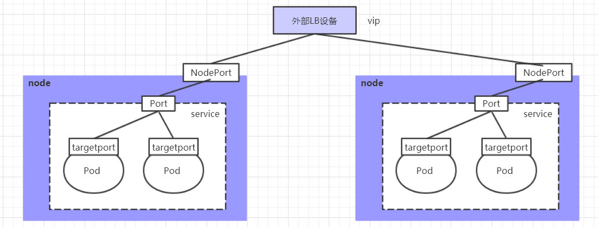

## 7.3 Service使用

### 7.3.1 实验环境准备

在使用service之前，首先利用Deployment创建出3个pod，注意要为pod设置`app=nginx-pod`的标签

创建deployment.yaml，内容如下：

```yaml
apiVersion: apps/v1
kind: Deployment      
metadata:
  name: pc-deployment
  namespace: dev
spec: 
  replicas: 3
  selector:
    matchLabels:
      app: nginx-pod
  template:
    metadata:
      labels:
        app: nginx-pod
    spec:
      containers:
      - name: nginx
        image: nginx:1.17.1
        ports:
        - containerPort: 80
```

```shell
[root@k8s-master01 ~]# kubectl create -f deployment.yaml
deployment.apps/pc-deployment created

# 查看pod详情
[root@k8s-master01 ~]# kubectl get pods -n dev -o wide --show-labels
NAME                             READY   STATUS     IP            NODE     LABELS
pc-deployment-66cb59b984-8p84h   1/1     Running    10.244.1.39   node1    app=nginx-pod
pc-deployment-66cb59b984-vx8vx   1/1     Running    10.244.2.33   node2    app=nginx-pod
pc-deployment-66cb59b984-wnncx   1/1     Running    10.244.1.40   node1    app=nginx-pod

# 为了方便后面的测试，修改下三台nginx的index.html页面（三台修改的IP地址不一致）
# kubectl exec -it pc-deployment-66cb59b984-8p84h -n dev /bin/sh
# echo "10.244.1.39" > /usr/share/nginx/html/index.html

#修改完毕之后，访问测试
[root@k8s-master01 ~]# curl 10.244.1.39
10.244.1.39
[root@k8s-master01 ~]# curl 10.244.2.33
10.244.2.33
[root@k8s-master01 ~]# curl 10.244.1.40
10.244.1.40
```

### 7.3.2 ClusterIP类型的Service

创建service-clusterip.yaml文件

```yaml
apiVersion: v1
kind: Service
metadata:
  name: service-clusterip
  namespace: dev
spec:
  selector:
    app: nginx-pod
  clusterIP: 10.97.97.97 # service的ip地址，如果不写，默认会生成一个
  type: ClusterIP
  ports:
  - port: 80  # Service端口       
    targetPort: 80 # pod端口
```

```shell
# 创建service
[root@k8s-master01 ~]# kubectl create -f service-clusterip.yaml
service/service-clusterip created

# 查看service
[root@k8s-master01 ~]# kubectl get svc -n dev -o wide
NAME                TYPE        CLUSTER-IP    EXTERNAL-IP   PORT(S)   AGE   SELECTOR
service-clusterip   ClusterIP   10.97.97.97   <none>        80/TCP    13s   app=nginx-pod

# 查看service的详细信息
# 在这里有一个Endpoints列表，里面就是当前service可以负载到的服务入口
[root@k8s-master01 ~]# kubectl describe svc service-clusterip -n dev
Name:              service-clusterip
Namespace:         dev
Labels:            <none>
Annotations:       <none>
Selector:          app=nginx-pod
Type:              ClusterIP
IP:                10.97.97.97
Port:              <unset>  80/TCP
TargetPort:        80/TCP
Endpoints:         10.244.1.39:80,10.244.1.40:80,10.244.2.33:80
Session Affinity:  None
Events:            <none>

# 查看ipvs的映射规则
[root@k8s-master01 ~]# ipvsadm -Ln
TCP  10.97.97.97:80 rr
  -> 10.244.1.39:80               Masq    1      0          0
  -> 10.244.1.40:80               Masq    1      0          0
  -> 10.244.2.33:80               Masq    1      0          0

# 访问10.97.97.97:80观察效果
[root@k8s-master01 ~]# curl 10.97.97.97:80
10.244.2.33
```

**Endpoint**

Endpoint是kubernetes中的一个资源对象，存储在etcd中，用来记录一个service对应的所有pod的访问地址，它是根据service配置文件中selector描述产生的。

一个Service由一组Pod组成，这些Pod通过Endpoints暴露出来，**Endpoints是实现实际服务的端点集合**。换句话说，service和pod之间的联系是通过endpoints实现的。


**负载分发策略**

对Service的访问被分发到了后端的Pod上去，目前kubernetes提供了两种负载分发策略：

- 如果不定义，默认使用kube-proxy的策略，比如随机、轮询

- 基于客户端地址的会话保持模式，即来自同一个客户端发起的所有请求都会转发到固定的一个Pod上

  此模式可以使在spec中添加`sessionAffinity:ClientIP`选项

```shell
# 查看ipvs的映射规则【rr 轮询】
[root@k8s-master01 ~]# ipvsadm -Ln
TCP  10.97.97.97:80 rr
  -> 10.244.1.39:80               Masq    1      0          0
  -> 10.244.1.40:80               Masq    1      0          0
  -> 10.244.2.33:80               Masq    1      0          0

# 循环访问测试
[root@k8s-master01 ~]# while true;do curl 10.97.97.97:80; sleep 5; done;
10.244.1.40
10.244.1.39
10.244.2.33
10.244.1.40
10.244.1.39
10.244.2.33

# 修改分发策略----sessionAffinity:ClientIP

# 查看ipvs规则【persistent 代表持久】
[root@k8s-master01 ~]# ipvsadm -Ln
TCP  10.97.97.97:80 rr persistent 10800
  -> 10.244.1.39:80               Masq    1      0          0
  -> 10.244.1.40:80               Masq    1      0          0
  -> 10.244.2.33:80               Masq    1      0          0

# 循环访问测试
[root@k8s-master01 ~]# while true;do curl 10.97.97.97; sleep 5; done;
10.244.2.33
10.244.2.33
10.244.2.33
  
# 删除service
[root@k8s-master01 ~]# kubectl delete -f service-clusterip.yaml
service "service-clusterip" deleted
```

### 7.3.3 HeadLiness类型的Service

在某些场景中，开发人员可能不想使用Service提供的负载均衡功能，而希望自己来控制负载均衡策略，针对这种情况，kubernetes提供了HeadLiness Service，这类Service不会分配Cluster IP，如果想要访问service，只能通过service的域名进行查询。

创建service-headliness.yaml

```yaml
apiVersion: v1
kind: Service
metadata:
  name: service-headliness
  namespace: dev
spec:
  selector:
    app: nginx-pod
  clusterIP: None # 将clusterIP设置为None，即可创建headliness Service
  type: ClusterIP
  ports:
  - port: 80    
    targetPort: 80
```

```shell
# 创建service
[root@k8s-master01 ~]# kubectl create -f service-headliness.yaml
service/service-headliness created

# 获取service， 发现CLUSTER-IP未分配
[root@k8s-master01 ~]# kubectl get svc service-headliness -n dev -o wide
NAME                 TYPE        CLUSTER-IP   EXTERNAL-IP   PORT(S)   AGE   SELECTOR
service-headliness   ClusterIP   None         <none>        80/TCP    11s   app=nginx-pod

# 查看service详情
[root@k8s-master01 ~]# kubectl describe svc service-headliness  -n dev
Name:              service-headliness
Namespace:         dev
Labels:            <none>
Annotations:       <none>
Selector:          app=nginx-pod
Type:              ClusterIP
IP:                None
Port:              <unset>  80/TCP
TargetPort:        80/TCP
Endpoints:         10.244.1.39:80,10.244.1.40:80,10.244.2.33:80
Session Affinity:  None
Events:            <none>

# 查看域名的解析情况
[root@k8s-master01 ~]# kubectl exec -it pc-deployment-66cb59b984-8p84h -n dev /bin/sh
/ # cat /etc/resolv.conf
nameserver 10.96.0.10
search dev.svc.cluster.local svc.cluster.local cluster.local

[root@k8s-master01 ~]# dig @10.96.0.10 service-headliness.dev.svc.cluster.local
service-headliness.dev.svc.cluster.local. 30 IN A 10.244.1.40
service-headliness.dev.svc.cluster.local. 30 IN A 10.244.1.39
service-headliness.dev.svc.cluster.local. 30 IN A 10.244.2.33
```

### 7.3.4 NodePort类型的Service

在之前的样例中，创建的Service的ip地址只有集群内部才可以访问，如果希望将Service暴露给集群外部使用，那么就要使用到另外一种类型的Service，称为NodePort类型。NodePort的工作原理其实就是**将service的端口映射到Node的一个端口上**，然后就可以通过`NodeIp:NodePort`来访问service了。


创建service-nodeport.yaml

```yaml
apiVersion: v1
kind: Service
metadata:
  name: service-nodeport
  namespace: dev
spec:
  selector:
    app: nginx-pod
  type: NodePort # service类型
  ports:
  - port: 80
    nodePort: 30002 # 指定绑定的node的端口(默认的取值范围是：30000-32767), 如果不指定，会默认分配
    targetPort: 80
```

```shell
# 创建service
[root@k8s-master01 ~]# kubectl create -f service-nodeport.yaml
service/service-nodeport created

# 查看service
[root@k8s-master01 ~]# kubectl get svc -n dev -o wide
NAME               TYPE       CLUSTER-IP      EXTERNAL-IP   PORT(S)       SELECTOR
service-nodeport   NodePort   10.105.64.191   <none>        80:30002/TCP  app=nginx-pod

# 接下来可以通过电脑主机的浏览器去访问集群中任意一个nodeip的30002端口，即可访问到pod
```

### 7.3.5 LoadBalancer类型的Service

LoadBalancer和NodePort很相似，目的都是向外部暴露一个端口，区别在于LoadBalancer会在集群的外部再来做一个负载均衡设备，而这个设备需要外部环境支持的，外部服务发送到这个设备上的请求，会被设备负载之后转发到集群中。



### 7.3.6 ExternalName类型的Service

ExternalName类型的Service用于引入集群外部的服务，它通过`externalName`属性指定外部一个服务的地址，然后在集群内部访问此service就可以访问到外部的服务了。


```shell
apiVersion: v1
kind: Service
metadata:
  name: service-externalname
  namespace: dev
spec:
  type: ExternalName # service类型
  externalName: www.baidu.com  #改成ip地址也可以
```

```shell
# 创建service
[root@k8s-master01 ~]# kubectl  create -f service-externalname.yaml
service/service-externalname created

# 域名解析
[root@k8s-master01 ~]# dig @10.96.0.10 service-externalname.dev.svc.cluster.local
service-externalname.dev.svc.cluster.local. 30 IN CNAME www.baidu.com.
www.baidu.com.          30      IN      CNAME   www.a.shifen.com.
www.a.shifen.com.       30      IN      A       39.156.66.18
www.a.shifen.com.       30      IN      A       39.156.66.14
```
