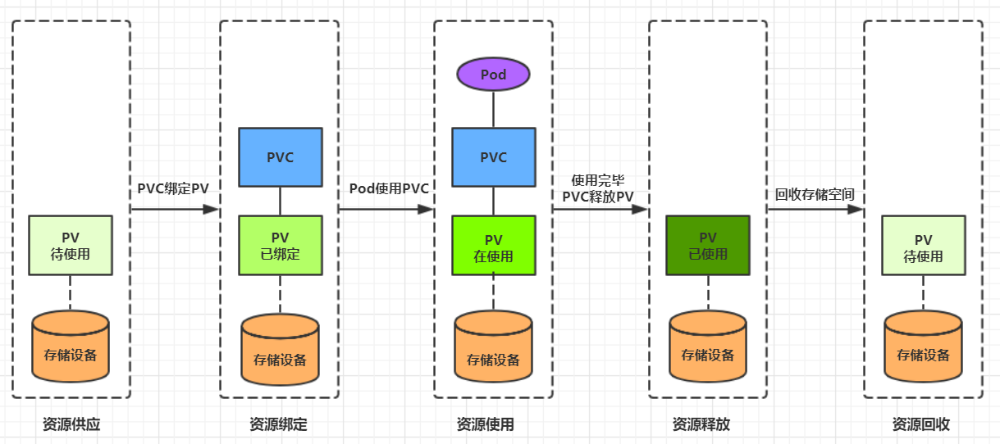

## 8.2 高级存储

前面已经学习了使用NFS提供存储，此时就要求用户会搭建NFS系统，并且会在yaml配置nfs。由于kubernetes支持的存储系统有很多，要求客户全都掌握，显然不现实。为了能够屏蔽底层存储实现的细节，方便用户使用， kubernetes引入PV和PVC两种资源对象。

PV（Persistent Volume）是持久化卷的意思，是对底层的共享存储的一种抽象。一般情况下PV由kubernetes管理员进行创建和配置，它与底层具体的共享存储技术有关，并通过插件完成与共享存储的对接。

PVC（Persistent Volume Claim）是持久卷声明的意思，是用户对于存储需求的一种声明。换句话说，PVC其实就是用户向kubernetes系统发出的一种资源需求申请。


使用了PV和PVC之后，工作可以得到进一步的细分：

- 存储：存储工程师维护
- PV： kubernetes管理员维护
- PVC：kubernetes用户维护

### 8.2.1 PV

PV是存储资源的抽象，下面是资源清单文件:

```yaml
apiVersion: v1  
kind: PersistentVolume
metadata:
  name: pv2
spec:
  nfs: # 存储类型，与底层真正存储对应
  capacity:  # 存储能力，目前只支持存储空间的设置
    storage: 2Gi
  accessModes:  # 访问模式
  storageClassName: # 存储类别
  persistentVolumeReclaimPolicy: # 回收策略
```

PV 的关键配置参数说明：

- **存储类型**

  底层实际存储的类型，kubernetes支持多种存储类型，每种存储类型的配置都有所差异

- **存储能力（capacity）**

目前只支持存储空间的设置( storage=1Gi )，不过未来可能会加入IOPS、吞吐量等指标的配置

- **访问模式（accessModes）**

  用于描述用户应用对存储资源的访问权限，访问权限包括下面几种方式：

  - ReadWriteOnce（RWO）：读写权限，但是只能被单个节点挂载
  - ReadOnlyMany（ROX）： 只读权限，可以被多个节点挂载
  - ReadWriteMany（RWX）：读写权限，可以被多个节点挂载

  `需要注意的是，底层不同的存储类型可能支持的访问模式不同`

- **回收策略（persistentVolumeReclaimPolicy）**

  当PV不再被使用了之后，对其的处理方式。目前支持三种策略：

  - Retain （保留） 保留数据，需要管理员手工清理数据
  - Recycle（回收） 清除 PV 中的数据，效果相当于执行 rm -rf /thevolume/*
  - Delete （删除） 与 PV 相连的后端存储完成 volume 的删除操作，当然这常见于云服务商的存储服务

  `需要注意的是，底层不同的存储类型可能支持的回收策略不同`

- **存储类别**

  PV可以通过storageClassName参数指定一个存储类别

  - 具有特定类别的PV只能与请求了该类别的PVC进行绑定
  - 未设定类别的PV则只能与不请求任何类别的PVC进行绑定

- **状态（status）**

  一个 PV 的生命周期中，可能会处于4中不同的阶段：

  - Available（可用）： 表示可用状态，还未被任何 PVC 绑定
  - Bound（已绑定）： 表示 PV 已经被 PVC 绑定
  - Released（已释放）： 表示 PVC 被删除，但是资源还未被集群重新声明
  - Failed（失败）： 表示该 PV 的自动回收失败

**实验**

使用NFS作为存储，来演示PV的使用，创建3个PV，对应NFS中的3个暴露的路径。

1) 准备NFS环境

```shell
# 创建目录
[root@nfs ~]# mkdir /root/data/{pv1,pv2,pv3} -pv

# 暴露服务
[root@nfs ~]# more /etc/exports
/root/data/pv1     192.168.5.0/24(rw,no_root_squash)
/root/data/pv2     192.168.5.0/24(rw,no_root_squash)
/root/data/pv3     192.168.5.0/24(rw,no_root_squash)

# 重启服务
[root@nfs ~]#  systemctl restart nfs
```

2) 创建pv.yaml

```yaml
apiVersion: v1
kind: PersistentVolume
metadata:
  name:  pv1
spec:
  capacity: 
    storage: 1Gi
  accessModes:
  - ReadWriteMany
  persistentVolumeReclaimPolicy: Retain
  nfs:
    path: /root/data/pv1
    server: 192.168.5.6

---

apiVersion: v1
kind: PersistentVolume
metadata:
  name:  pv2
spec:
  capacity: 
    storage: 2Gi
  accessModes:
  - ReadWriteMany
  persistentVolumeReclaimPolicy: Retain
  nfs:
    path: /root/data/pv2
    server: 192.168.5.6
    
---

apiVersion: v1
kind: PersistentVolume
metadata:
  name:  pv3
spec:
  capacity: 
    storage: 3Gi
  accessModes:
  - ReadWriteMany
  persistentVolumeReclaimPolicy: Retain
  nfs:
    path: /root/data/pv3
    server: 192.168.5.6
```

```shell
# 创建 pv
[root@k8s-master01 ~]# kubectl create -f pv.yaml
persistentvolume/pv1 created
persistentvolume/pv2 created
persistentvolume/pv3 created

# 查看pv
[root@k8s-master01 ~]# kubectl get pv -o wide
NAME   CAPACITY   ACCESS MODES  RECLAIM POLICY  STATUS      AGE   VOLUMEMODE
pv1    1Gi        RWX            Retain        Available    10s   Filesystem
pv2    2Gi        RWX            Retain        Available    10s   Filesystem
pv3    3Gi        RWX            Retain        Available    9s    Filesystem
```

### 8.2.2 PVC

PVC是资源的申请，用来声明对存储空间、访问模式、存储类别需求信息。下面是资源清单文件:

```yaml
apiVersion: v1
kind: PersistentVolumeClaim
metadata:
  name: pvc
  namespace: dev
spec:
  accessModes: # 访问模式
  selector: # 采用标签对PV选择
  storageClassName: # 存储类别
  resources: # 请求空间
    requests:
      storage: 5Gi
```

PVC 的关键配置参数说明：

- **访问模式（accessModes）**

用于描述用户应用对存储资源的访问权限

- **选择条件（selector）**

  通过Label Selector的设置，可使PVC对于系统中己存在的PV进行筛选

- **存储类别（storageClassName）**

  PVC在定义时可以设定需要的后端存储的类别，只有设置了该class的pv才能被系统选出

- **资源请求（Resources ）**

  描述对存储资源的请求

**实验**

1) 创建pvc.yaml，申请pv

```yaml
apiVersion: v1
kind: PersistentVolumeClaim
metadata:
  name: pvc1
  namespace: dev
spec:
  accessModes: 
  - ReadWriteMany
  resources:
    requests:
      storage: 1Gi
---
apiVersion: v1
kind: PersistentVolumeClaim
metadata:
  name: pvc2
  namespace: dev
spec:
  accessModes: 
  - ReadWriteMany
  resources:
    requests:
      storage: 1Gi
---
apiVersion: v1
kind: PersistentVolumeClaim
metadata:
  name: pvc3
  namespace: dev
spec:
  accessModes: 
  - ReadWriteMany
  resources:
    requests:
      storage: 1Gi
```

```shell
# 创建pvc
[root@k8s-master01 ~]# kubectl create -f pvc.yaml
persistentvolumeclaim/pvc1 created
persistentvolumeclaim/pvc2 created
persistentvolumeclaim/pvc3 created

# 查看pvc
[root@k8s-master01 ~]# kubectl get pvc  -n dev -o wide
NAME   STATUS   VOLUME   CAPACITY   ACCESS MODES   STORAGECLASS   AGE   VOLUMEMODE
pvc1   Bound    pv1      1Gi        RWX                           15s   Filesystem
pvc2   Bound    pv2      2Gi        RWX                           15s   Filesystem
pvc3   Bound    pv3      3Gi        RWX                           15s   Filesystem

# 查看pv
[root@k8s-master01 ~]# kubectl get pv -o wide
NAME  CAPACITY ACCESS MODES  RECLAIM POLICY  STATUS    CLAIM       AGE     VOLUMEMODE
pv1    1Gi        RWx        Retain          Bound    dev/pvc1    3h37m    Filesystem
pv2    2Gi        RWX        Retain          Bound    dev/pvc2    3h37m    Filesystem
pv3    3Gi        RWX        Retain          Bound    dev/pvc3    3h37m    Filesystem   
```

2) 创建pods.yaml, 使用pv

```yaml
apiVersion: v1
kind: Pod
metadata:
  name: pod1
  namespace: dev
spec:
  containers:
  - name: busybox
    image: busybox:1.30
    command: ["/bin/sh","-c","while true;do echo pod1 >> /root/out.txt; sleep 10; done;"]
    volumeMounts:
    - name: volume
      mountPath: /root/
  volumes:
    - name: volume
      persistentVolumeClaim:
        claimName: pvc1
        readOnly: false
---
apiVersion: v1
kind: Pod
metadata:
  name: pod2
  namespace: dev
spec:
  containers:
  - name: busybox
    image: busybox:1.30
    command: ["/bin/sh","-c","while true;do echo pod2 >> /root/out.txt; sleep 10; done;"]
    volumeMounts:
    - name: volume
      mountPath: /root/
  volumes:
    - name: volume
      persistentVolumeClaim:
        claimName: pvc2
        readOnly: false
```

```shell
# 创建pod
[root@k8s-master01 ~]# kubectl create -f pods.yaml
pod/pod1 created
pod/pod2 created

# 查看pod
[root@k8s-master01 ~]# kubectl get pods -n dev -o wide
NAME   READY   STATUS    RESTARTS   AGE   IP            NODE   
pod1   1/1     Running   0          14s   10.244.1.69   node1   
pod2   1/1     Running   0          14s   10.244.1.70   node1  

# 查看pvc
[root@k8s-master01 ~]# kubectl get pvc -n dev -o wide
NAME   STATUS   VOLUME   CAPACITY   ACCESS MODES      AGE   VOLUMEMODE
pvc1   Bound    pv1      1Gi        RWX               94m   Filesystem
pvc2   Bound    pv2      2Gi        RWX               94m   Filesystem
pvc3   Bound    pv3      3Gi        RWX               94m   Filesystem

# 查看pv
[root@k8s-master01 ~]# kubectl get pv -n dev -o wide
NAME   CAPACITY   ACCESS MODES   RECLAIM POLICY   STATUS   CLAIM       AGE     VOLUMEMODE
pv1    1Gi        RWX            Retain           Bound    dev/pvc1    5h11m   Filesystem
pv2    2Gi        RWX            Retain           Bound    dev/pvc2    5h11m   Filesystem
pv3    3Gi        RWX            Retain           Bound    dev/pvc3    5h11m   Filesystem

# 查看nfs中的文件存储
[root@nfs ~]# more /root/data/pv1/out.txt
node1
node1
[root@nfs ~]# more /root/data/pv2/out.txt
node2
node2
```

### 8.2.3 生命周期

PVC和PV是一一对应的，PV和PVC之间的相互作用遵循以下生命周期：

- **资源供应**：管理员手动创建底层存储和PV

- **资源绑定**：用户创建PVC，kubernetes负责根据PVC的声明去寻找PV，并绑定

  在用户定义好PVC之后，系统将根据PVC对存储资源的请求在已存在的PV中选择一个满足条件的

  - 一旦找到，就将该PV与用户定义的PVC进行绑定，用户的应用就可以使用这个PVC了
  - 如果找不到，PVC则会无限期处于Pending状态，直到等到系统管理员创建了一个符合其要求的PV

  PV一旦绑定到某个PVC上，就会被这个PVC独占，不能再与其他PVC进行绑定了

- **资源使用**：用户可在pod中像volume一样使用pvc

  Pod使用Volume的定义，将PVC挂载到容器内的某个路径进行使用。

- **资源释放**：用户删除pvc来释放pv

  当存储资源使用完毕后，用户可以删除PVC，与该PVC绑定的PV将会被标记为“已释放”，但还不能立刻与其他PVC进行绑定。通过之前PVC写入的数据可能还被留在存储设备上，只有在清除之后该PV才能再次使用。

- **资源回收**：kubernetes根据pv设置的回收策略进行资源的回收

  对于PV，管理员可以设定回收策略，用于设置与之绑定的PVC释放资源之后如何处理遗留数据的问题。只有PV的存储空间完成回收，才能供新的PVC绑定和使用


