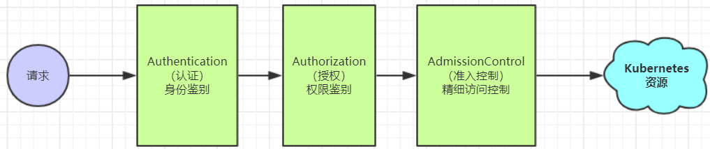

## 9.1 访问控制概述

Kubernetes作为一个分布式集群的管理工具，保证集群的安全性是其一个重要的任务。所谓的安全性其实就是保证对Kubernetes的各种**客户端**进行**认证和鉴权**操作。

**客户端**

在Kubernetes集群中，客户端通常有两类：

- **User Account**：一般是独立于kubernetes之外的其他服务管理的用户账号。
- **Service Account**：kubernetes管理的账号，用于为Pod中的服务进程在访问Kubernetes时提供身份标识。

**认证、授权与准入控制**

ApiServer是访问及管理资源对象的唯一入口。任何一个请求访问ApiServer，都要经过下面三个流程：

- Authentication（认证）：身份鉴别，只有正确的账号才能够通过认证
- Authorization（授权）： 判断用户是否有权限对访问的资源执行特定的动作
- Admission Control（准入控制）：用于补充授权机制以实现更加精细的访问控制功能。

